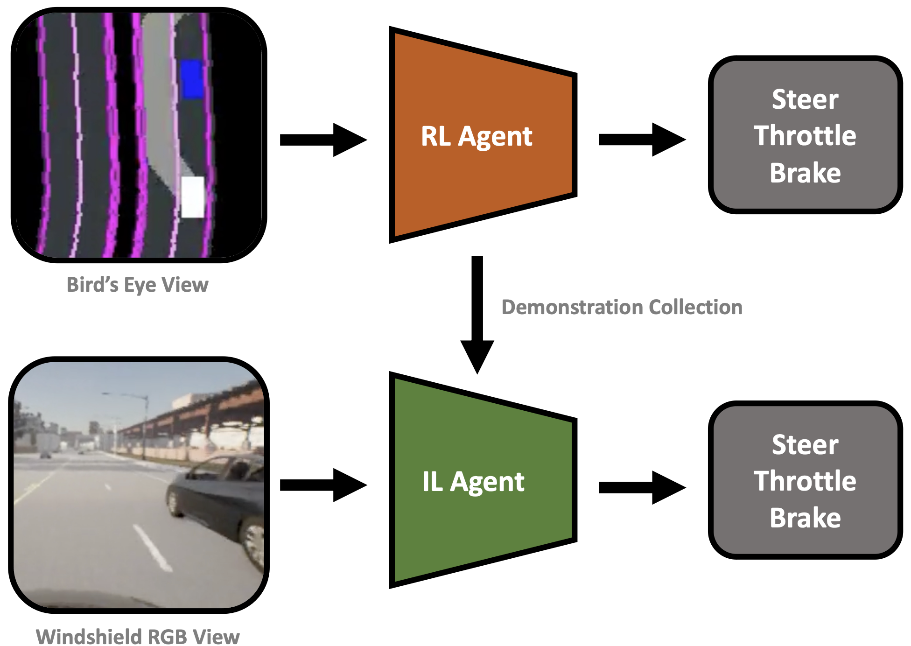

# Vision-Based Algorithms for Obstacle Avoidance and Detection in Autonomous Vehicles



Ryan Diaz (diaz0329@umn.edu) (advised by Yevgeniy Vorobeychik (yvorobeychik@wustl.edu))

This is a codebase representing my work done over the course of the Summer 2024 CSE REU program at Washington University in St. Louis. Specifically, it handles training a vision-based static obstacle avoidance agent using knowledge distillation between a privileged RL agent and a visuomotor IL agent in the CARLA [1] simulation (the other repository I worked on that focused on obstacle detection in CARLA can be found [here](https://github.com/RyangDiaz/carla-yolo-dataset-generator)). This repository originally started off as a fork of the repository for the paper [End-to-End Urban Driving by Imitating a Reinforcement Learning Coach (Roach)](https://arxiv.org/abs/2108.08265) [2]. This paper constitutes the main foundation of my method and heavily inspired a lot of my ideas.

## Resources

- This document will provide instructions for running the code to train an expert RL policy, collect demonstration data, and train a visuomotor IL policy. It will also give a brief overview of the repository structure and important files to consider when setting up the environment, model, and training algorithms. 

- For a more comprehensive view of the Roach repository code, please refer to the original repository [here](https://github.com/zhejz/carla-roach).

- For a full documentation of the project, including a description of the methods and suggested future directions, please refer to [this](REU_Summer_2024_Project_Documentation.pdf) document.

## Setup

### CARLA

Follow [these](https://carla.readthedocs.io/en/0.9.15/start_quickstart/) instructions to install the CARLA simulation environment. For a quick (and preferred) setup, you may also run CARLA through [Docker](https://carla.readthedocs.io/en/0.9.15/build_docker/). Note that we specifically use CARLA 0.9.15, as that is the current version supported by the packaged version of the CARLA client (installed with `pip install carla`).

Depending on the method used to install CARLA, you may need to modify `utils/server_utils.py` and input the appropriate command for `cmd` in the `start()` function needed to launch the CARLA server. If you are running CARLA through Docker, there is no need to change the command.

### Python Environment

It is preferred to use a Python virtual environment manager such as Mamba (or Conda). To create an environment using Mamba and install all required dependencies:

```bash
  mamba create -n roach python=3.10
  mamba activate roach
  pip install -r requirements.txt
```

If you are using Conda, simply replace `mamba` with `conda`.

### Weights and Biases

Roach has a fairly robust training system that makes frequent use of the logging tool [Weights and Biases](https://wandb.ai/home). If you do not have an account, be sure to make one and log in on your device with the API key.

## Running the Code

### Training Pipeline

The training pipeline consists of 6 steps, and is meant to guide one through the process of learning behaviors through knowledge distillation:

1. Training an expert RL agent using bird's eye view data to follow routes and obey traffic rules.
2. Collecting demonstrations from the trained RL agent that involves the avoidance of static obstacles.
3. Training an IL agent using data from windshield RGB images to follow routes, obey traffic rules, and avoid static obstacles.
4. Evaluating the trained IL agent.
5. Collecting additional demonstrations from the IL agent for further imitation learning using the DAgger algorithm.
6. Repeating steps 3-5 until the IL agent has achieved satisfactory performance.

Details on specific steps can be found below.

### Training the Expert RL Agent

To train an expert using reinforcement learning:

```bash
bash run/train_rl.sh
```

You can configure the training run by modifying `config/train_rl.yaml` and its accomanying config files. Specifically, you can change the number of parallel environments that the agent will be trained on, and what maps each of the environments will be running (refer to `config/train_envs/route_follow.yaml` for an example). We find that 4 environments seems to be the most we can have in parallel without excessive crashing (the original Roach paper uses 6), but the availability of GPU memory may limit this further. If you have multiple GPUs, you can specify the GPU mapping of each environment with the `gpu` flag for each environment in the config file.

With the instability of the CARLA server, the training process may crash a few times during the whole run. The code is designed to automatically restart the server and resume the training process(*). However, doing this involves stopping the existing CARLA servers which may require sudo permissions. To avoid having to manually input the sudo password every time, you can (with extreme caution) put your password in the `sudo_password` variable in `utils/server_utils.py`. You can view training logs and evaluation rollouts in either the generated `outputs` folder or on Weights and Biases.

(*) The entire process fails if `checkpoints.txt` is not present in the `outputs` folder, which is only put there if the RL training has gone through at least one cycle of evaluation rollouts. In this case, you will have to manually restart training.

### Collecting Expert Demonstrations

To collect initial expert demonstrations for imitation learning:

```bash
bash run/data_collect_bc.sh
```

You will need to modify `data_collect_bc.sh` to take in the appropriate arguments. Specifically, make sure you have the Weights and Biases train run ID for your trained RL agent. You may also choose to use the pretrained RL agent from the original Roach paper.

### Training the Visuomotor IL Agent

To train a visuomotor agent using behavior cloning (or with DAgger later in the training process):

```bash
bash run/train_il.sh
```

You will need to modify `train_il.sh` to take in the appropriate arguments. If you are on the first training iteration with just expert collected data, make sure you have the Weights and Biases train run ID for your trained RL agent as well as the path to where your collected data is stored. If you are on a DAgger training iteration, make sure you have the Weights and Biases train run ID for your previously-trained IL agent as well as the path where your collected DAgger data is stored.

Training the imitation learning agent typically requires a lot of GPU memory, though the memory load can be distributed across multiple GPUs. With 30 total collected demonstrations, I find that on two GPUs the training process takes around 10-11GB each of memory. If you are bottlenecked by GPU memory, consider reducing the batch size.

### Evaluating Trained Agents

To evaluate a trained agent:

```bash
bash run/benchmark.sh
```

You can evaluate either your trained expert RL agent on a set of general driving routes, or your trained IL agent on a specific route set up for learning obstacle avoidance behavior. You can determine this in `benchmark.sh` (and will need to modify it to take in the appropriate arguments as before).

### Collecting Additional Demonstrations

To use the initial IL agent to collect additional demonstrations for imitation learning:

```bash
bash run/data_collect_dagger.sh
```

You will need to modify `data_collect_dagger.sh` to take in the appropriate arguments. Specifically, make sure you have the Weights and Biases train run ID for your trained IL agent. You will also need to input the folder path to your newly collected DAgger demos.

## Codebase Overview

Below is a description of important files and folders to keep in mind if you are looking to make changes to the existing algorithm.

### agents/cilrs_bbox and agents/rl_birdview

These folders contain the code for training and running both the expert reinforcement learning policy and the visuomotor imitation learning policy. Both folders have a similar structure: `*_agent.py` handles model loading and calling the apporpriate functions for input processing and training. `*_wrapper.py` handles the actual preprocessing of observations before being fed into the policy as well as handling the debugging visualizations. `rl_birdview/ppo_policy.py` and `cilrs_bbox/models/cilrs_model.py` contain the code for the actual observation to action translation within the policy, including observation encoding and action decoding. 

### carla_gym/core

---

**`carla_gym/core/obs_manager`**

This folder contains all the logic for handling all of the incoming input modalities for our policies from the CARLA simulation. If you wanted to add in a new input modality (such as semantic segmentation), you should do so here. Follow the template provided in the existing inputs to get a good sense of how the data should interact with the rest of the codebase. Once you have implemented your new input modality, be sure to update the config files in `config/agent/cilrs_bbox/obs_configs` and/or `config/agent/ppo/obs_configs` to include the new data.

If this new data is to be collected in demonstration as input to the imitation learning policy, you will also need to modify the `write()` function in `utils/saving_utils.py` to explicitly record your data.

---

**`carla_gym/core/task_actor`**

In this folder, you will find two important files related to the behavior of the vehicle in the simulation:

`task_actor/common/task_vehicle.py` contains code representing the main actor in the simulation that the RL and IL policies will be running on. In particular, this code was modified from the original Roach codebase to include explicit obstacle detection and avoidance behavior when an obstacle (car/pedestrian) is detected in front of the vehicle.

`task_actor/ego_vehicle/reward/valeo_action.py` implements the reward used by the RL agent in the initial expert training phase. You can modify this reward if you desire to learn specific behaviors for the vehicle.

---

### carla_gym/envs

This folder contains the code for handling the environments for the training and rollout of the RL and IL agents. The base environment code is in `envs/carla_multi_agent_env.py`, with more specific environments inheriting from the `CarlaMultiAgentEnv` class. In particular, RL training is done in the "EndlessEnv" (`envs/suites/endless_env.py`) and IL training is done in the "SimpleRouteEnv" (`envs/suites/simple_route_env.py`). If you are looking to test specific routes in a map, you can specify them in the `envs/scenario_descriptions` folder (refer to the SimpleRouteEnv as an example).

## References

[1] A. Dosovitskiy, G. Ros, F. Codevilla, A. Lopez, and V. Koltun, “CARLA: An open urban driving simulator,” in Proceedings of the 1st Annual Conference on Robot Learning, ser. Proceedings of Machine Learning Research, S. Levine, V. Vanhoucke, and K. Goldberg, Eds., vol. 78. PMLR, 13-15 Nov 2017, pp. 1-16.

[2] Z. Zhang, A. Liniger, D. Dai, F. Yu, and L. Van Gool, “End-to-end urban driving by imitating a reinforcement learning coach,” in Proceedings of the IEEE/CVF International Conference on Computer Vision (ICCV), 2021.
